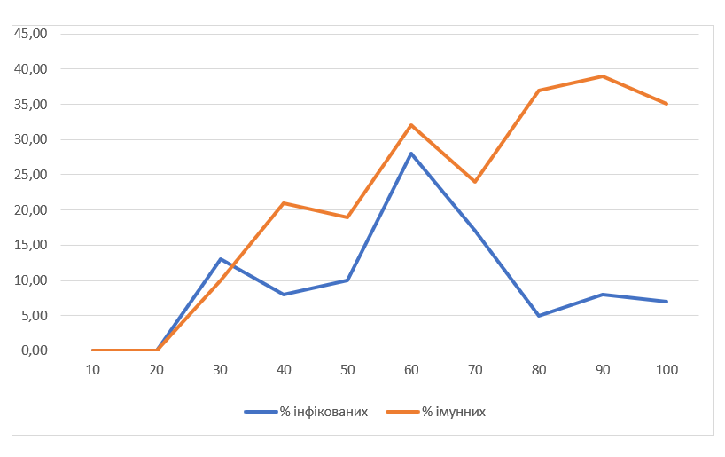
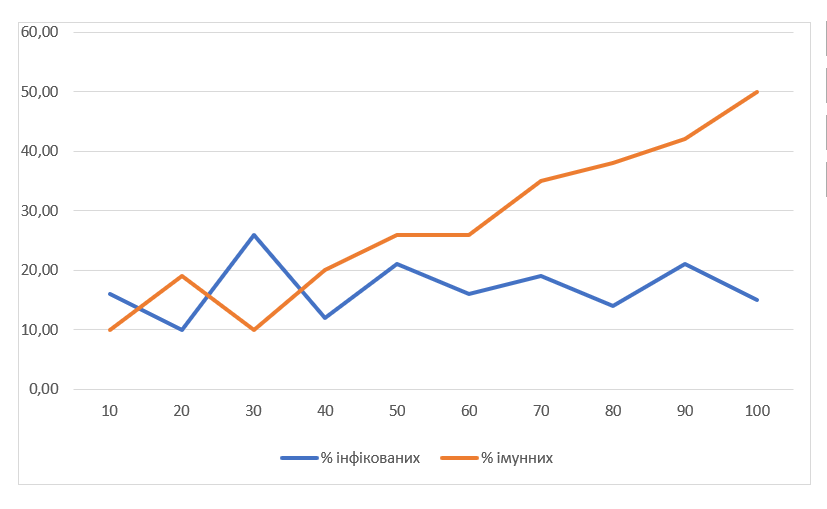
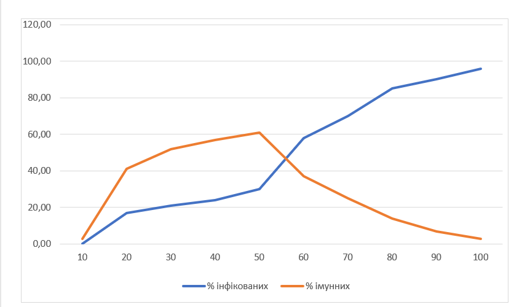

## Комп'ютерні системи імітаційного моделювання
## СПм-22-4, **Гайдай Ярослав Андрійович**
### Лабораторна робота №**1**. Опис імітаційних моделей та проведення обчислювальних експериментів

 

### Варіант 3, Модель поширення захворювання у людській популяції.:
[Virus](https://www.netlogoweb.org/launch#https://www.netlogoweb.org/assets/modelslib/Sample%20Models/Biology/Virus.nlogo)

 

### Вербальний опис моделі:
Ця модель імітує поширення вірусу в людській популяції з початковими 150 особами, включаючи 10 заражених. Люди можуть померти від інфекції чи старості. Якщо загальна кількість населення менше 300 осіб , то здорові особи можуть народжувати здорове, але сприйнятливе до інфекції потомство. Люди переміщуються випадковим чином і можуть бути в трьох станах: здорові та сприйнятливі до інфекції (зелений); хворі та інфекційні (червоний); здорові та імунні (сірий). 

### Керуючі параметри:
- **number-people** визначає кількість кількість людей у симуляції
- **infectiousness** визначає, наскільки велика ймовірність передачі вірусу, коли інфікована та сприйнятлива особа перебувають на одній ділянці.
- **chance-recover** ймовірність того, що інфекція завершиться одужанням/імунітетом. Наприклад, коли цей повзунок встановлено на нуль, інфекція завжди смертельна.
- **duration** визначає кількість тижнів до смерті або одужання інфікованої людини.

### Внутрішні параметри:
- **sick?** якщо true, то людина заразна.
- **remaining-immunity** визначає скільки тижнів імунітету залишилося у людини
- **sick-time** визначає як довго людина була заразною
- **lifespan** параметр, що визначає тривалість життя людей у моделі. У даному випадку, lifespan встановлено на 2600 тижнів, що відповідає приблизно 50 рокам.
- **age** визначає вік людини у тижнях.
- **chance-reproduce** визначає ймовірність того, що людина породить потомство.
- **immunity-duration** визначає скільки тижнів тримається імунітет.

### Показники роботи системи:
- **%infected** який % населення є заразними, тобто хворими, інфікованими.
- **%immune** який % населення має імунітет.
- **years** скільки пройшло років.
- **Populations** кількість інфікованих, здорових, імунних людей та загальна кількість людей.

### Примітки:
- Часто спочатку відбувається вибух інфекції, оскільки ніхто з населення не застрахований. Це приблизно відповідає початковому «спалаху» вірусної інфекції в популяції, яка часто має руйнівні наслідки для людей. Однак незабаром вірус стає менш поширеним, оскільки динаміка популяції змінюється.
- Віруси, які спочатку були надто успішними (інфікуючи майже всіх), можуть не вижити в довгостроковій перспективі. Оскільки в результаті всі інфіковані зазвичай помирають або стають імунними, потенційна кількість носіїв часто обмежена.
  
### Недоліки моделі:
- Неможливо вказати початкову кількість інфікованих.
- Немає впливу віку на інфікування та результат захворювання.
- Здорові люди ніяк не уникають інфікованих людей.
- Немає можловісті регулювання тривалості імунітету та вірогідності захворіти повторно.

 

## Обчислювальні експерименти
### 1. Вплив заразності вірусу на кількість інфікованих
Досліджується залежність кількості інфікованих та імунних людей від заразності вірусу за 100 тактів.
Експерименти проводяться при 10-100 значеннях заразності, з кроком 10, усього 10 симуляцій.  
Інші керуючі параметри мають значення за замовчуванням:
- **number-people**: 150
- **chance-recover**: 75%
- **duration**: 20

<table>
<thead>
<tr><th>Заразність</th><th>% інфікованих</th><th>% імунних</th></tr>
</thead>
<tbody>
<tr><td>10</td><td>0</td><td>0</td></tr>
<tr><td>20</td><td>0</td><td>0</td></tr>
<tr><td>30</td><td>13</td><td>10</td></tr>
<tr><td>40</td><td>8</td><td>21</td></tr>
<tr><td>50</td><td>10</td><td>19</td></tr>
<tr><td>60</td><td>28</td><td>32</td></tr>
<tr><td>70</td><td>17</td><td>24</td></tr>
<tr><td>80</td><td>5</td><td>37</td></tr>
<tr><td>90</td><td>8</td><td>39</td></tr>
<tr><td>100</td><td>7</td><td>35</td></tr>
</tbody>
</table>

Заразність вірусу має значущий вплив на перебіг епідемії в популяції. Графік наочно показує, що при низькій заразності (10-20) кількість інфікованих і імунних залишається на низькому рівні і у вірусу немає шансу вижити у популяції Зі збільшенням заразності (30-40) збільшується як кількість інфікованих, так і імунних осіб. При високій заразності (60 і вище) спостерігається значний ріст кількості імунних осіб та зменшення інфікованих, адже при високій заразності більша частина популяції швидко заражається та набуває імунітету.

### 2. Вплив шансу одужати на кількість інфікованих
Досліджується залежність кількості інфікованих та імунних людей від шансу одужати за 100 тактів.
Експерименти проводяться при 10-100 значеннях шансу одужати, з кроком 10, усього 10 симуляцій.  
Інші керуючі параметри мають значення за замовчуванням:
- **number-people**: 150
- **infectiousness**: 65%
- **duration**: 20

<table>
<thead>
<tr><th>Шанс одужати</th><th>% інфікованих</th><th>% імунних</th></tr>
</thead>
<tbody>
<tr><td>10</td><td>16</td><td>10</td></tr>
<tr><td>20</td><td>10</td><td>19</td></tr>
<tr><td>30</td><td>26</td><td>10</td></tr>
<tr><td>40</td><td>12</td><td>20</td></tr>
<tr><td>50</td><td>21</td><td>26</td></tr>
<tr><td>60</td><td>16</td><td>26</td></tr>
<tr><td>70</td><td>19</td><td>35</td></tr>
<tr><td>80</td><td>14</td><td>38</td></tr>
<tr><td>90</td><td>21</td><td>42</td></tr>
<tr><td>100</td><td>15</td><td>50</td></tr>
</tbody>
</table>

Графік наочно показує, що зі збільшенням шансу одужання спостерігається зростання відсотка імунних осіб в популяції. Це можна пояснити тим, що більше людей виживають після хвороби і мають більший шанс набути імунітет. Також, слід зауважати, що при високому шансі вмерти від хвороби пагубно впливає, як на популяцію люей так і на вірус, адже вірус може шввидко знищити всіх людей і вимерти сам, тому це не найкраща для нього стратегія.

### 3. Вплив тривалості хвороби на кількість інфікованих
Досліджується залежність кількості інфікованих та імунних людей від тривалості хвороби за 100 тактів.
Експерименти проводяться при 10-100 значеннях тривалості хвороби, з кроком 10, усього 10 симуляцій.  
Інші керуючі параметри мають значення за замовчуванням:
- **number-people**: 150
- **infectiousness**: 65%
- **chance-recover**: 75%

<table>
<thead>
<tr><th>Тривалість хвороби</th><th>% інфікованих</th><th>% імунних</th></tr>
</thead>
<tbody>
<tr><td>10</td><td>0</td><td>3</td></tr>
<tr><td>20</td><td>17</td><td>41</td></tr>
<tr><td>30</td><td>21</td><td>52</td></tr>
<tr><td>40</td><td>24</td><td>57</td></tr>
<tr><td>50</td><td>30</td><td>61</td></tr>
<tr><td>60</td><td>58</td><td>37</td></tr>
<tr><td>70</td><td>70</td><td>25</td></tr>
<tr><td>80</td><td>85</td><td>14</td></tr>
<tr><td>90</td><td>90</td><td>7</td></tr>
<tr><td>100</td><td>96</td><td>3</td></tr>
</tbody>
</table>

Графік наочно показує, що чим довше триває хвороба, тим більше людей інфікується. Це може бути пов'язано з тим, що тривала хвороба має більше часу для поширення серед популяції. Але також видно, що хвороба з низькою тривалістю (наприклад 10 і менше) взагалі не має шансу вижити в популяції, тому що не встигає розповсюдитись.
